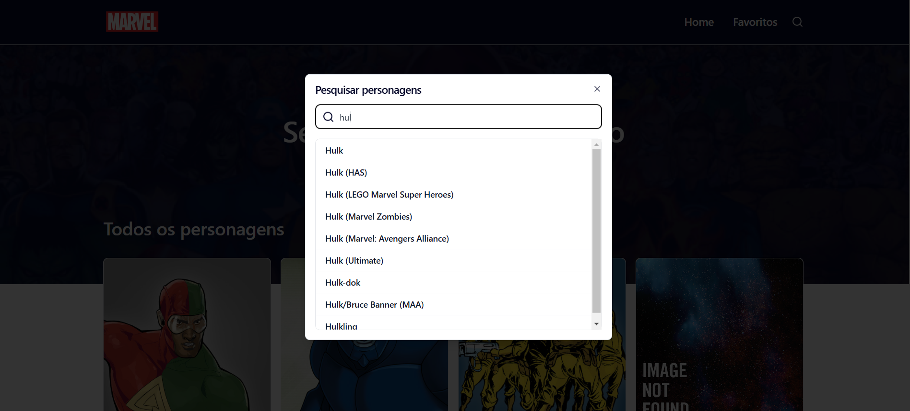
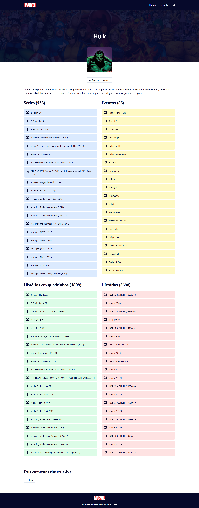
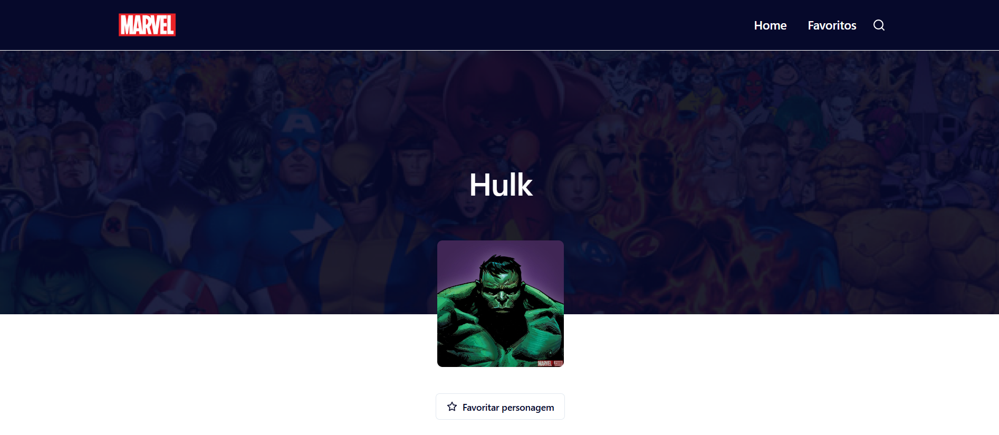
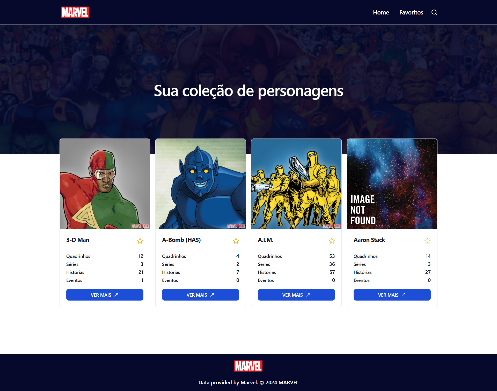
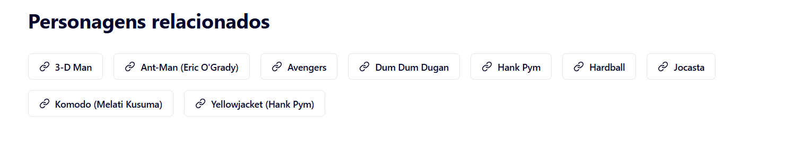
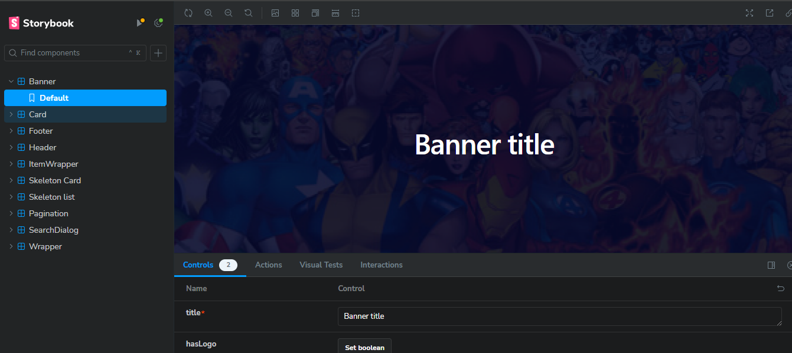
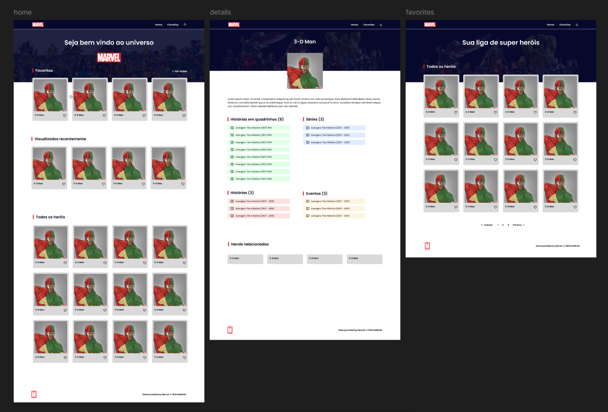

# Desafio

O projeto consiste em uma tela de listagem de heróis com busca e uma tela de detalhes que
deve conter a maior quantidade possível de informações e uma opção para favoritar o herói.

## 🛠️ Tecnologias Utilizadas

- **Vite**: Ferramenta de construção rápida e eficiente para desenvolvimento com front-end.
- **React**: Biblioteca JavaScript para construção de interfaces de usuário.
- **TailwindCSS**: Framework CSS para estilização rápida e responsiva.
- **shadcn/ui**: Componentes UI estilizados com TailwindCSS.
- **Marvel API**: API pública da Marvel para acesso aos dados dos personagens.
- **Storybook**: Criação e visualização de componentes isolados.
- **Vitest**: Testes unitários com um foco em desempenho e simplicidade.
- **Playwright**: Testes end-to-end para garantir a qualidade da aplicação.
- **MSW (Mock Service Worker)**: Simulação de APIs para testes e desenvolvimento sem dependência da API externa.

## 🚀 Funcionalidades

- **Catálogo de Personagens**: Lista de personagens com páginação, uma seção de
persoangens favoritos e uma seção de personagens visualizados recentemente.


<br>
<br>
<br>

- **Pesquisa Dinâmica**: Pesquisa de personagens pelo nome.


<br>
<br>
<br>

- **Detalhamento do Personagem**: Veja uma página dedicada com mais informações sobre cada personagem.


<br>
<br>
<br>

- **Adicionar personagens favoritos**: Adicione/remova personagens favoritos clicando em favoritar personagem ou clicando no ícone de estrelas contidas no cards de personagens.


<br>
<br>
<br>

- **Personagens favoritos**: Página com a lista de personagens favoritos.


<br>
<br>
<br>

- **Personagens realacionados**: Sugestão de personagens que possui realação com o persoangem visualizado, localizado no final da tela de detalhes do personagem.


<br>
<br>
<br>

## 📋 Pré-requisitos

Para rodar a aplicação, você precisará ter o **Node.js** (>=20) instalado.

## 📦 Instalação

1. Clone este repositório:

```bash
   git clone https://github.com/rafaelgcaldas/desafio.git
```

<br>

2. Instale as dependências:

```bash
    npm install
```

<br>

3. Crie um arquivo .env na raiz do projeto e adicione suas chaves da API da Marvel e url base da api da Marvel:

```bash
    VITE_API_URL = "https://gateway.marvel.com"
    VITE_API_MARVEL_PUBLIC_KEY = ""
    VITE_API_MARVEL_PRIVATE_KEY = ""
```
Para obter as chaves da API da MARVEL, [crie uma conta de desenvolvedor](https://developer.marvel.com/account).

<br>

## ▶️ Executando a Aplicação

Para rodar o servidor de desenvolvimento, use:

```bash
    npm run dev
```

A aplicação estará disponível em http://localhost:5173.

<br>

## 📚 Storybook

Para visualizar e desenvolver componentes isoladamente com Storybook, execute:

```bash
    npm run storybook
```

<br>



Acesse o Storybook em http://localhost:6006.

<br>

## 🧪 Testes

### Testes Unitários

Execute os testes com Vitest:

```bash
    npm run test
    # ou com yarn
    npm run test:watch
```

<br>

### Testes End-to-End

Para rodar testes end-to-end com Playwright:

```bash
    npm run test:e2e
    # ou com a interface gráfica
    npm run test:ui
```

<br>

## API da Marvel

### - Obter listas de personagens

```bash
  /v1/public/characters
```

<br>

### - Obter um único personagem por id

```bash
  /v1/public/characters/{characterId}
```

<br>

### - Obter listas de personagens fitrada pelo nome

```bash
  /v1/public/characters?nameStartsWith=name
```

<br>


### - Obter listas de personagens relacionados

Os personagens relacionados são obtidos à partir de personagens contidos nas mesmas
histórias em quadrinhos.

```bash
  /v1/public/characters/{characterId}/comics
```

<br>

Para uma explicação mais detalhada da estrutura da API, leia a [Documentação](https://developer.marvel.com/docs) completa.

<br>

## Simulação de API com MSW

MSW é configurado para simular respostas da API Marvel durante o desenvolvimento e testes. Isso permite o desenvolvimento off-line e testes consistentes. A simulação é automaticamente ativada no ambiente de testes.

Crie um arquivo .env.test na raiz do projeto e adicione a propriedade "VITE_API_URL" como valor "/"

```bash
    VITE_API_URL = "/"
```

<br>

Para rodar em modo de test:

```bash
    npm run dev:test
```

<br>

## 🌈 Estilização

A aplicação utiliza TailwindCSS para facilitar a criação de layouts responsivos e personalizados. Componentes adicionais (Button e Dialog) foram abstraídos da biblioteca shadcn/ui.

<br>

# 🖼️ Estilização construído com figma


